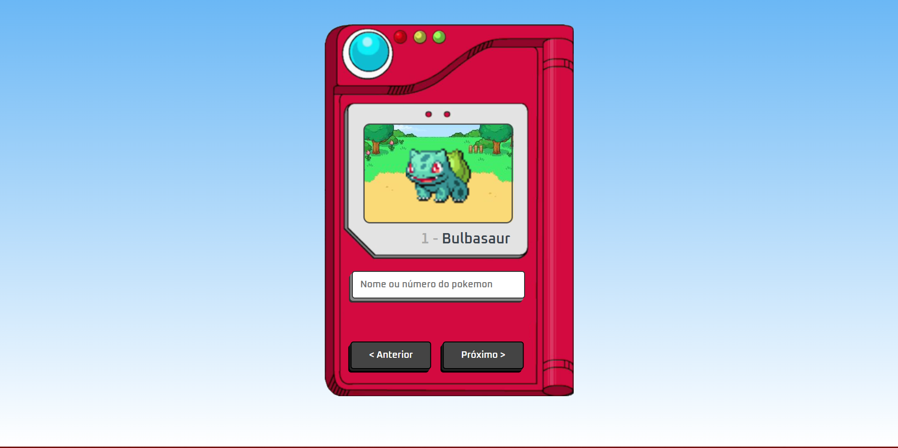

<h2 align="center">
   Pokedex 
</h2>

<p align="center">
  <a href="#-projeto">Projeto</a>&nbsp;&nbsp;&nbsp;|&nbsp;&nbsp;&nbsp;
  <a href="#-tecnologias">Tecnologias</a>&nbsp;&nbsp;&nbsp;|&nbsp;&nbsp;&nbsp;
  <a href="#-Layout">Layout</a>&nbsp;&nbsp;&nbsp;|&nbsp;&nbsp;&nbsp;
  <a href="#-licença">Licença</a>
</p>

## 💻 Projeto

Nesse desafio, foi desenvolvido uma pokedex

-   [x] Buscar pokemons por nome ou número
-   [x] Paginar pokemons

### 📸 Imagens

**Lista Preenchida**


## 🚀 Tecnologias

Esse projeto foi desenvolvido com as seguintes tecnologias:

-   [VueJs](https://vuejs.org/)
-   [TypeScript](https://www.typescriptlang.org/pt/)
-   [Vite](https://vitejs.dev/)

## 📝 Licença

Esse projeto está sob a licença MIT. Veja o arquivo [LICENSE](LICENSE) para mais detalhes.

```

```
